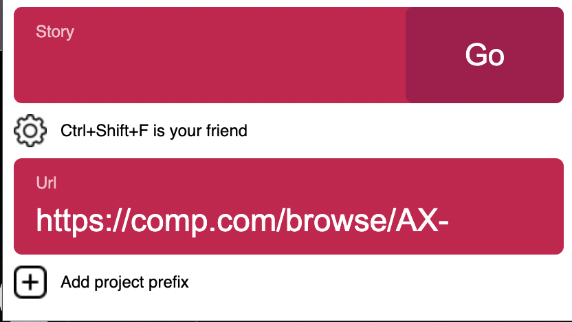
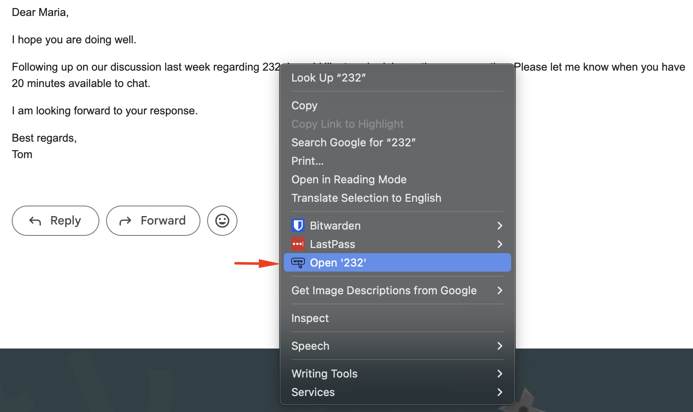
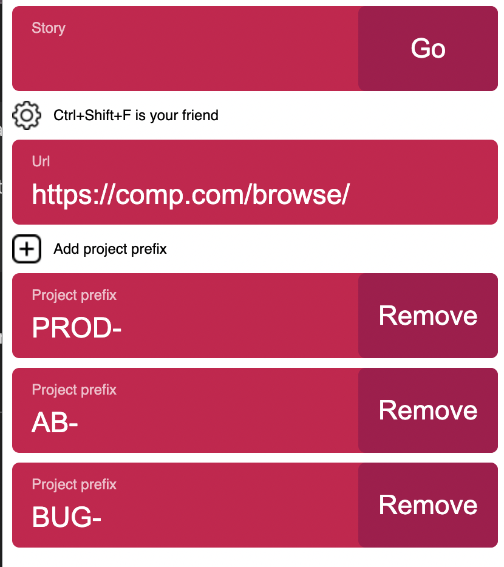

Usually when you work with same website/application and you deal with a lot of links but only the last part of the URL link is changing, this extension gives you ability to setup the fixed part and access those links by their last part.

You can install the extension from [here](https://chrome.google.com/webstore/detail/combine-url/lnmkibhfmgahenghonphjlepcdbdjpon).

For example, if you have a lot of tasks in Jira and all they have the same base URL but only the last few characters are different.

* https://comp.com/browse/AX-3830
* https://comp.com/browse/AX-3822
* https://comp.com/browse/AX-2592  
You can setup this extension as:

And when you press CTR+SHIFT+F, a popup will appear where you only write the last 4 characters, for example 3830, and by pressing enter or Go button, the link will be opened in new tab.

Additional thing you can do is to use the `right-click` context menu on your browser when you select a text, that is the ID of the url you want to open.
For example:

## If you have multiple projects, for example ##

* https://comp.com/browse/PROD-3830
* https://comp.com/browse/AB-3822
* https://comp.com/browse/BUG-2592  

You can setup this extension as:

And now, when you use the extension, with the shortcut or the right-click context, a separate tab will open for each of the defined project prefixes.