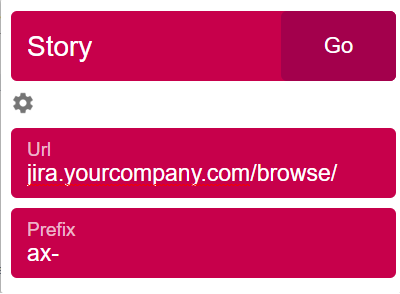

Usually when you work with same website/application and you deal with a lot of links but only the last part of the URL link is changing, this extension gives you ability to setup the fixed part and access those links by their last part.

You can instal the extension for: 
1. Chrome from [here](https://chrome.google.com/webstore/detail/combine-url/lnmkibhfmgahenghonphjlepcdbdjpon).
2. Firefox from [here](https://addons.mozilla.org/en-US/firefox/addon/combine-url-extensions/).

For example, if you have a lot of tasks in Jira and all they have the same base URL but only the last few characters are different.

* https://jira.yourcompany.com/browse/AX-3830
* https://jira.yourcompany.com/browse/AX-3822
* https://jira.yourcompany.com/browse/AX-2592  
You can setup this extension as:

And when you press CTR+SHIFT+F, a popup will appear where you only write the last 4 characters, for example 3830, and by pressing enter or Go button, the link will be opened in new tab.

